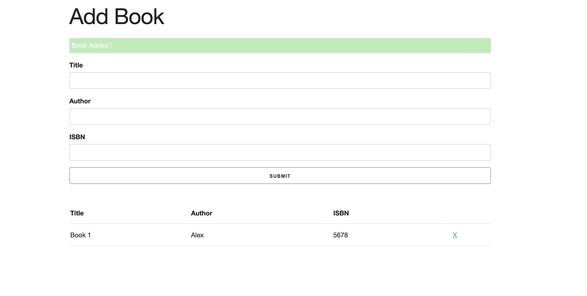

# bookListApp
## Intro
simple App with vanilla JS.
This Js App is only working on the front end with local storage to store data.
We can:
- Register books
- Delete books

## Live Demo

http://anvialex.me/bookListApp/

## Setup 
You can clone this repo by doing:
`git clone git@github.com:Anvi98/bookListApp.git`

## Author

[Anvi Alex](https://www.linkedin.com/in/anvi-alex-eponon/)

